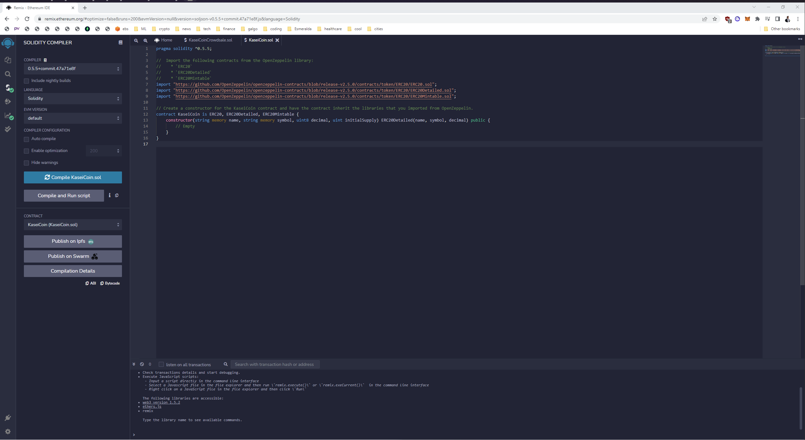
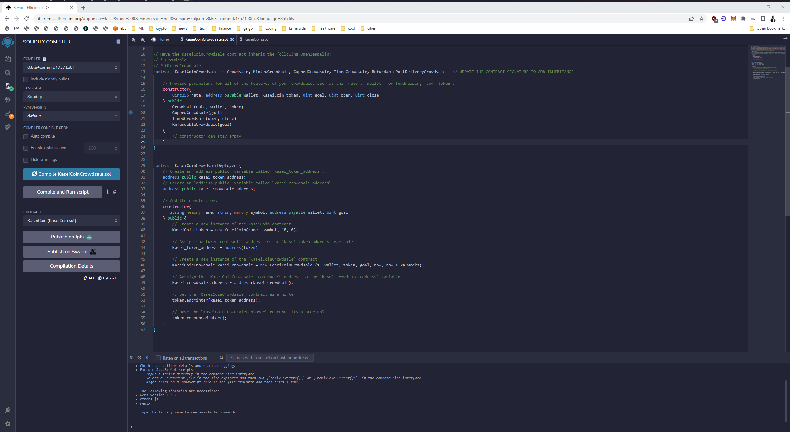
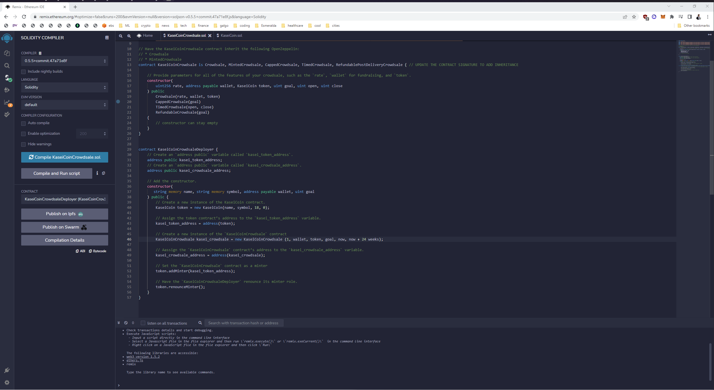

# Module 21

## Instructions
You will create a fungible token that is ERC-20 compliant and that will be minted by using a `Crowdsale` contract from the OpenZeppelin Solidity library.

The crowdsale contract that you create will manage the entire crowdsale process, allowing users to send ether to the contract and in return receive KAI, or KaseiCoin tokens. Your contract will mint the tokens automatically and distribute them to buyers in one transaction.

---
## Installation Guide
Upload file `KaseiCoinCrowdsale.sol` and `KaseiCoin.sol` in https://remix.ethereum.org/ 

---
## Usage
##### 1. Deploy contract `KaseiCoinCrowdsaleDeployer`
- Select the contract `KaseiCoinCrowdsaleDeployer`
- Fill in the variables, using a Ganache Address for "wallet"
- Accept transaction in Metamask
##### 2. Deploy contract `KaseiCoinCrowdsale`
- Click button for `kasei_crowdsale_address`
- Copy Address `kasei_crowdsale_address` and paste in "AT_ADDRESS"
- Click on "AT_ADDRESS"
##### 3. Deploy contract `KaseiCoin`
- Click button for `kasei_token_address`
- Copy Address `kasei_token_address` and paste in "AT_ADDRESS"
- Click on "AT_ADDRESS"

---
## Evaluation Evidence
##### Step 1: Create the KaseiCoin Token Contract

##### Step 2: Create the KaseiCoin Crowdsale Contract

##### Step 3: Create the KaseiCoin Deployer Contract

##### Step 4: Deploy the Crowdsale to a Local Blockchain
###### Deployment of the contract to a local blockchain with Remix, MetaMask, and Ganache.

###### Using test accounts to buy new tokens from the crowdsale and then checking the balances associated with the test accounts.

###### After purchasing tokens with test accounts, viewing the total supply of minted tokens and the amount of wei that has been raised by the crowdsale.

---
## Contributors
Gabriel Alcivar
[Email](mailto:galcivar@galgomedia.com) - [LinkedIn](https://www.linkedin.com/in/gabriel-alcivar-aa83a710b/) - [GitHub](https://github.com/galcivar/)

---

## MIT License

Copyright (c) [2022] [Gabriel Alcivar]

Permission is hereby granted, free of charge, to any person obtaining a copy
of this software and associated documentation files (the "Software"), to deal
in the Software without restriction, including without limitation the rights
to use, copy, modify, merge, publish, distribute, sublicense, and/or sell
copies of the Software, and to permit persons to whom the Software is
furnished to do so, subject to the following conditions:

The above copyright notice and this permission notice shall be included in all
copies or substantial portions of the Software.

THE SOFTWARE IS PROVIDED "AS IS", WITHOUT WARRANTY OF ANY KIND, EXPRESS OR
IMPLIED, INCLUDING BUT NOT LIMITED TO THE WARRANTIES OF MERCHANTABILITY,
FITNESS FOR A PARTICULAR PURPOSE AND NONINFRINGEMENT. IN NO EVENT SHALL THE
AUTHORS OR COPYRIGHT HOLDERS BE LIABLE FOR ANY CLAIM, DAMAGES OR OTHER
LIABILITY, WHETHER IN AN ACTION OF CONTRACT, TORT OR OTHERWISE, ARISING FROM,
OUT OF OR IN CONNECTION WITH THE SOFTWARE OR THE USE OR OTHER DEALINGS IN THE
SOFTWARE.
